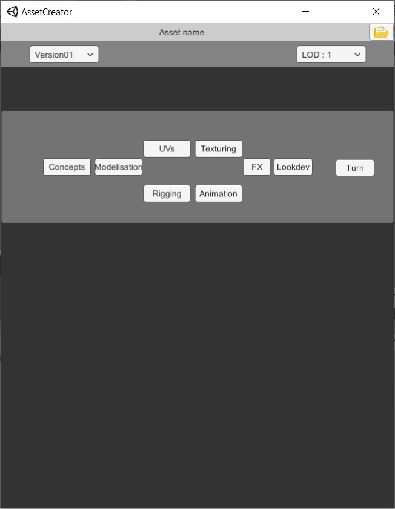
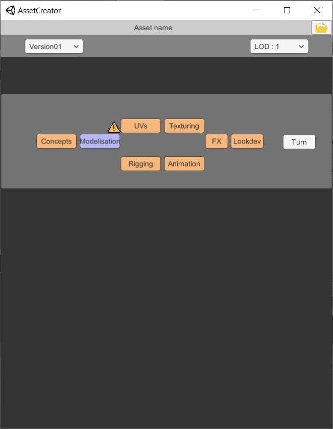
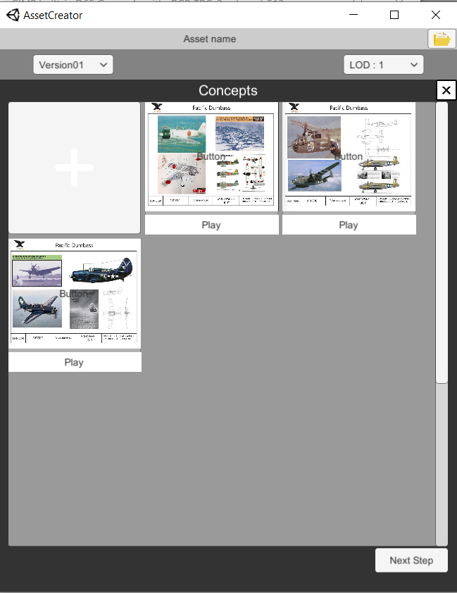

# AssetCreator
Proof Of Concept Using C#/Unity to manage the creation of an Asset via a classic Pipeline production.
You can get a global view of each stage of the asset production and check if there is problems.

